# Crud com Java Spring e Angular

## Introdução

Um simples crud que serve como base para um desenvolvimento full-stack inicial de uma aplicação web que utiliza Java, Spring Boot e Angular, salvando tudo em um repositório utilizando git. 

Nada teórico vai ser mostrado aqui, apenas um passo a passo técnico para servir de consulta. Para extender a aplicação e o conhecimento, basta dar uma "googlada" nos termos e eventuais erros que tudo vai fazendo sentido e o aprendizado vai fluindo.

O ideal é já ter uma base de conhecimento em Lógica de Programação, POO, Java, Banco de Dados Relacional e TypeScript.

obs: Foi utilizado o Windows 10 como Sistema Operacional, então algumas alterações terão que ser feitas para quando utilizar alguma distribuição Linux (ou Mac). 

<br>

## É preciso ter instalado


- Git
  - também criar conta no github 

- Java 8+

- Banco de dados MySQL

- SGBD (DBeaver, Workbench)

- Node.js lts 

- Angular CLI

- Editor de texto (VScode, Atom, notepad++, etc...)

- IDE (IntelliJ, Eclipse, etc...)

- Postman (para testar a API antes de fazer o front-end)

## Essa aplicação faz o seguinte

Um usuário cadastra seu nome e vai adicionando conteúdos que ele consome, como filmes, livros, animes e por aí vai.

<br>

## Agora vamos ao passo a passo

<br>

## Git e Github

No site do github com sua conta logada, ir em "Repositórios".


Depois em "Novo".

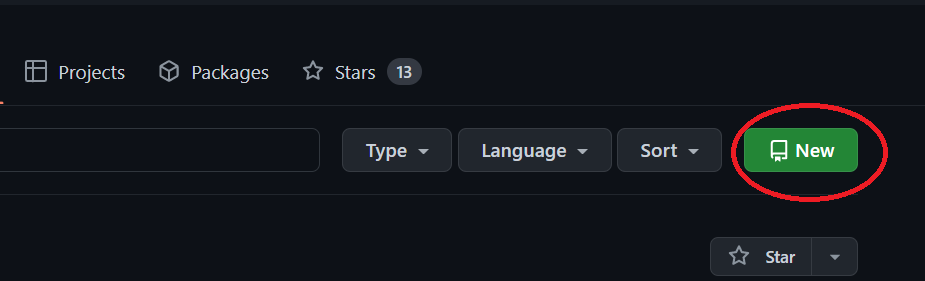

Dê um nome ao projeto.

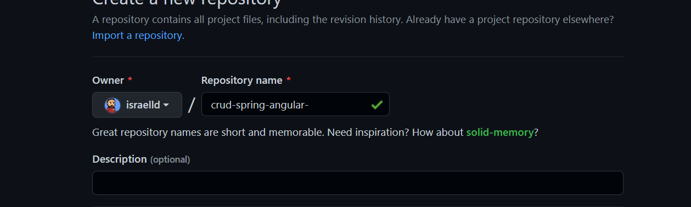

Marque para adicionar o README (ou não, você quem sabe), e crie o repositório.

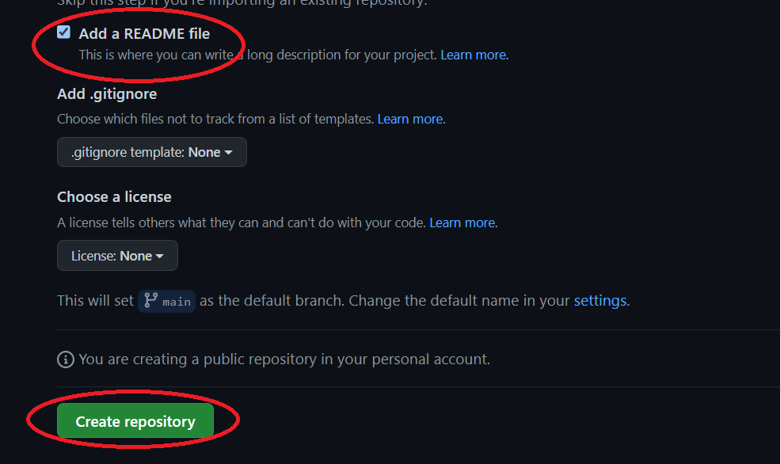

Com o repositório criar, vá em código e copie o link.

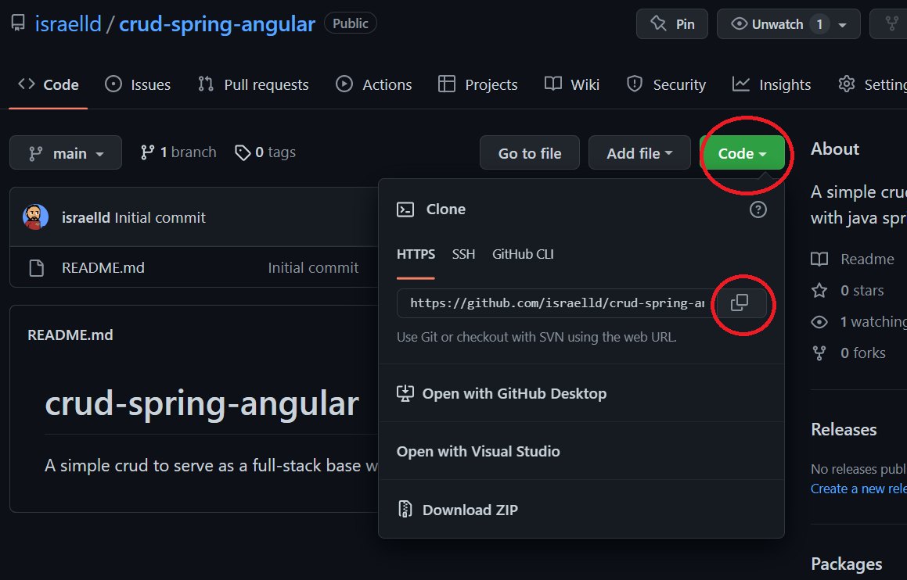

Abra a pasta que você queira deixar seu projeto armazenado na sua máquina, clique com o botão direito e depois em "Git Bash Here".


Na janela aberta, escreva "git clone" dê um espaço e depois cole o link copiado com Shift + Insert.

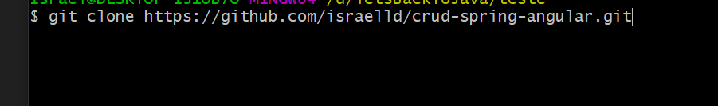

Pronto, agora com o projeto na máquina, sempre que houver alterações, basta seguir os comando de:

-  git add arquivosCriados
  
ou

-  git add *

- git commit -m "mensagem do commit"  

- git push

Existem muitos outros comando e funcionalidades do git, o ideal é ir testando e entendendo no decorrer do aprendizado.

<br>

## Back-end

Abra o site "Spring Initializr".

Configure no site:

- Project: Maven
- Language: Java
- Spring Boot: 2.7 (ou outra versão estável)
- Project Metadata:
  - Packaging: Jar
  - Java: 11 (ou sua versão instalada)
  - O resto não vai impedir o funcionamento, mas é interessante para organizar o projeto.
- Dependências:
  - Spring Boot DevTools
  - Spring Data JPA
  - Spring Web
  - MySQL Driver

E então gerar o projeto.

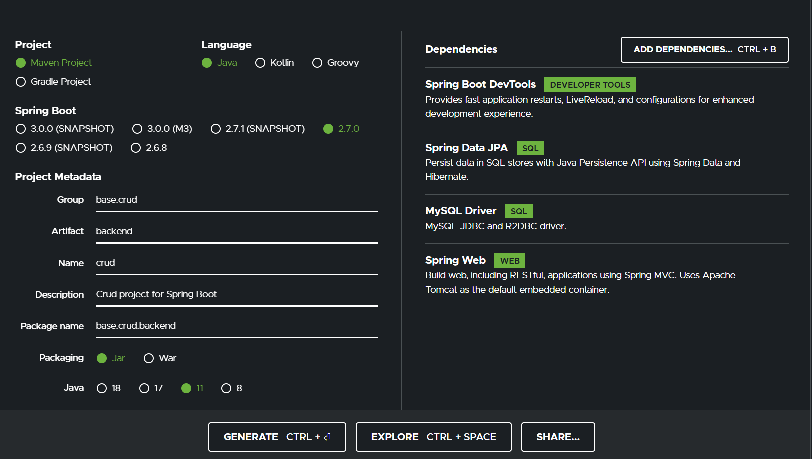

Basta extrair o arquivo zip baixando no diretório desejado e abrir esse projeto na IDE.

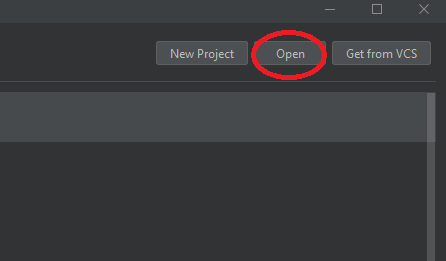

E depois confirmar.

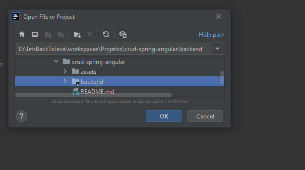

Agora é criar a seguinte estrutura de pacotes:


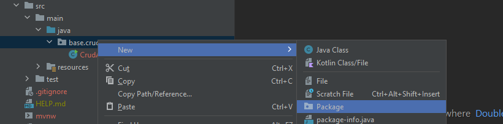

> controllers
> 
> services
> 
> repositories
> 
> models

Ficando assim:
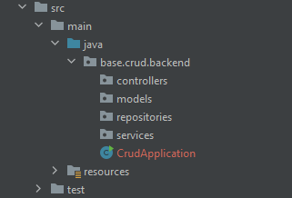

obs: O nome do arquivo fica em vermelho por não estar adicionado ao git. 

> Model

Crie uma nova classe dentro do pacote "models" com a abstração de um usuário.

O nome da classe pode ser "Usuario".

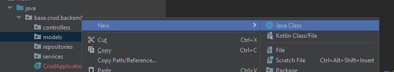

Anote a classe com "@Entity" e importe seu pacote (No caso do IntelliJ basta selecionar Ctrl + Espaço que aparecerá as opções). As anotações dizem ao Spring qual o comportamento e funcionalidade a classe terá no sistema. Mas essa anotação pertence ao JPA para fazer o mapeamento da classe, assim como as demais anotações utilizadas nas classes de modelo.

```Java
import javax.persistence.Entity;

@Entity
public class Usuario {
}
```

E então implementar as abstrações da classe:

```Java
@Entity
public class Usuario {

    @Id
    @GeneratedValue(strategy = GenerationType.IDENTITY)
    Long id;
    String nome;
    String email;
    String senha;
    String sobrenome;

    // Construtor, Getters, Setters, Equals e HashCode

}
```

As IDEs ajudam na criação dos:

- Construtores
- Getters e Setters
- Equals e HashCode

Basta clicar com o botão direito (ou utilizar o atalho).

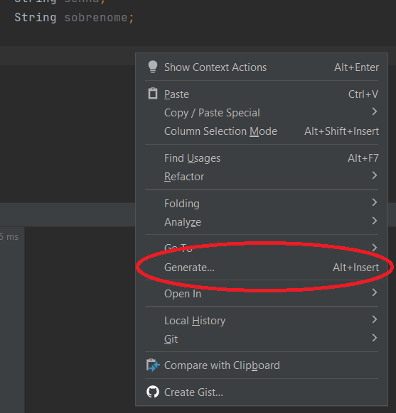

```Java
    public Usuario() {
    }

    public Usuario(String nome, String email, String senha, String sobrenome) {
        this.nome = nome;
        this.email = email;
        this.senha = senha;
        this.sobrenome = sobrenome;
    }

    // Getters, Setters, Equals e HashCode

```

Da mesma maneira criar uma classe para representar a mídia que o usuário consumiu. A anotação "@ManyToOne" é para dizer ao JPA que um "Usuario" pode ter vários objetos "Midia" associados a ele, criando uma relação no banco de dados seguindo o sentido da anotação. 

```Java
@Entity
public class Midia {

    @Id
    @GeneratedValue(strategy = GenerationType.IDENTITY)
    Long id;
    String titulo;
    String tipo;
    String nota;
    String descrição;
    @ManyToOne
    Usuario usuario;

    // Construtor, Getters, Setters, Equals e HashCode

}
```

> Repository

Da mesma maneira que as classes foram criadas, crie uma interface (batas alterar o nome Classe para Interface) com o mesmo nome do model seguido de "Repository" dentro do pacote repositories.

Ficando assim.

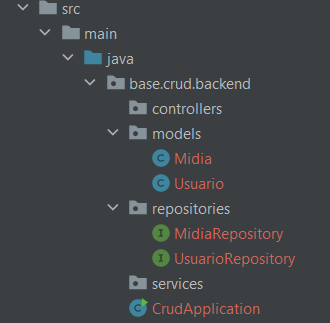

Ao criar a interface estará assim.

```Java
public interface UsuarioRepository {
}
```

Depois estenda a interface "JpaRepository" e adicione a anotação "@Repository".

```Java
@Repository
public interface UsuarioRepository extends JpaRepository<Usuario, Long>{
}
```

> Service

Da mesma maneira que as classes foram criadas, crie uma classe no pacote "service" com o mesmo nome do model seguido de "Service".

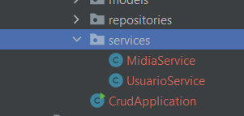

Dentro de cada classe, monte a seguinte estrutura:

```Java

@Service
public class UsuarioService {

    @Autowired
    private UsuarioRepository repository;

    public Usuario findById(Long id) {
        Optional<Usuario> obj = repository.findById(id);
        return obj.orElse(null);
    }
    public List<Usuario> findAll() {
        return repository.findAll();
    }
    public Usuario update(Long id, Usuario obj) {
        Usuario newObj = findById(id);
        newObj.setNome(obj.getNome());
        newObj.setSobrenome(obj.getSobrenome());
        newObj.setEmail(obj.getEmail());
        newObj.setSenha(obj.getSenha());
        return repository.save(newObj);
    }
    public Usuario create(Usuario obj) {
        return repository.save(obj);
    }
    public void delete(Long id) {
        findById(id);
        repository.deleteById(id);
    }
    
}
```

A anotação @Service diz ao Spring que é nesta classe que as regras de negócio da aplicação estarão, e a anotação @Autowired faz a injeção de dependência, deixando a cargo do Spring.

Com isso, a lógica do CRUD está implementada, já é possível criar, alterar, deletar, encontrar usuário pelo Id e retornar todos os usuários. Agora basta replicar essa mesma lógica para a classe "MidiaService".

> Controllers

Só falta implementar a porta de acesso da aplicação, crie uma classe no pacote "controllers" com o mesmo nome do model seguido de "Controller".

A implementação de "UsuarioController" fica assim:

```Java

@CrossOrigin("*")
@RestController
@RequestMapping("/usuario")
public class UsuarioControllers {

    @Autowired
    private UsuarioService service;

    @GetMapping("/{id}")
    public ResponseEntity<Usuario> GetById(@PathVariable Long id) {
        Usuario obj = this.service.findById(id);
        return ResponseEntity.ok().body(obj);
    }

    @GetMapping
    public ResponseEntity<List<Usuario>> GetAll() {
        List<Usuario> list = service.findAll();
        return ResponseEntity.ok().body(list);
    }

    @PostMapping
    public ResponseEntity<Usuario> Post(@RequestBody Usuario usuario) {
        Usuario newObj = service.create(usuario);
        return ResponseEntity.status(HttpStatus.GONE).body(service.create(usuario));
    }

    @PutMapping("/{id}")
    public ResponseEntity<Usuario> Put(@PathVariable Long id, @RequestBody Usuario obj) {
        Usuario newUsuario = service.update(id, obj);
        return ResponseEntity.status(HttpStatus.ACCEPTED).body(newUsuario);
    }

    @DeleteMapping("/{id}")
    public ResponseEntity<Void> Delete(@PathVariable Long id) {
        service.delete(id);
        return ResponseEntity.noContent().build();
    }
}

```

A anotação @CrossOrigin("*") define quem pode interagir com os endpoints.

@RestController define o tipo da classe para o entendimento por parte do Spring.

@RequestMapping("/usuario") define o endpoint daquele controller.

@GetMapping, @PostMapping, @PutMapping e @DeleteMapping são os verbos HTTP para que haja a comunicação REST.

E com isso
